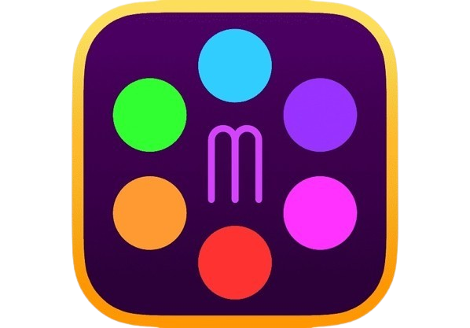
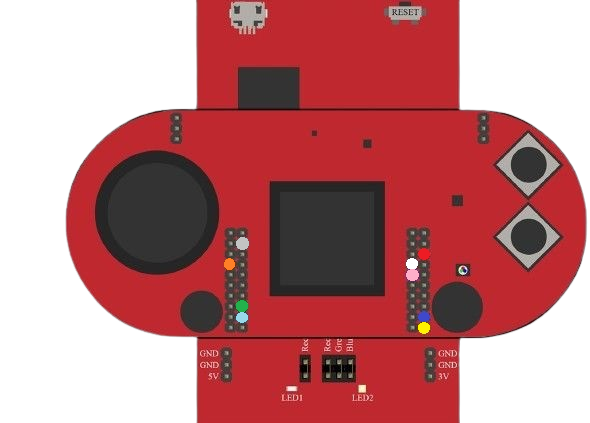
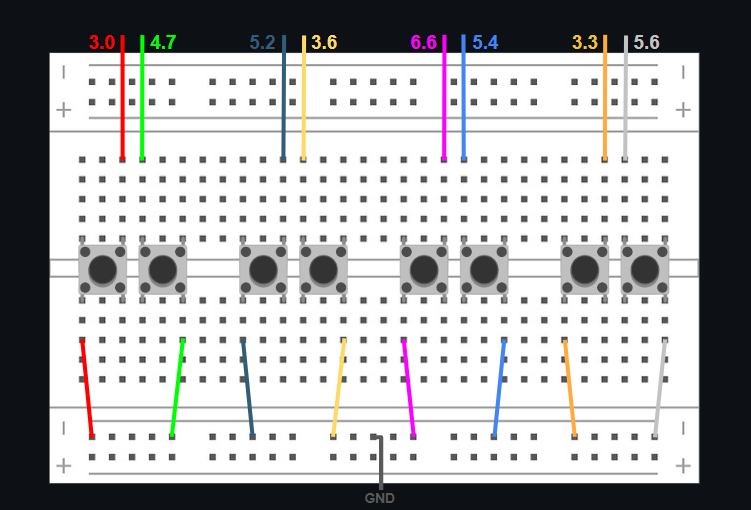
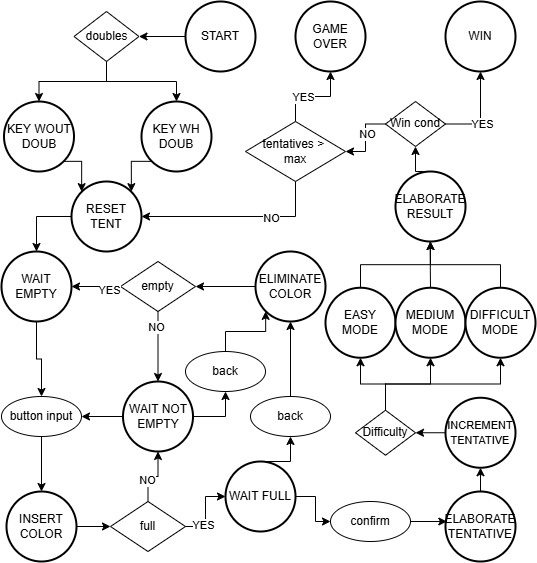

<h1 align="center">Mastermind</h1>
<div align="center">
  
</div>

## Table of Contents
- [Introduction](#introduction)
- [Project Layout](#project-layout)
- [Software and Hardware Requirements](#software-and-hardware-requirements)
  - [Hardware Requirements](#hardware-requirements) 
  - [Software Requirements](#software-requirements)
- [Installation and Configuration](#installation-and-configuration)
  - [Setup IDE](#setup-ide)
  - [Import Project](#import-project)
  - [Import Libraries](#import-libraries)
  - [Run Project](#run-project)
- [Code Overview](#code-overview)
  - [Software Algorithm](#software-algorithm)
  - [Menu](#menu)
  - [Connectivity Sensors and MPS432](#connectivity-sensors-and-MSP432)
- [Work Contribution](#work-contribution)
- [Future Integrations](#future-integrations) 
- [Contacts](#contacts)
  
---

# Introduction
[](https://www.youtube.com/watch?v=asKY3cJsWYA)

[](https://www.youtube.com/watch?v=Nvdm1BBGjmU)

The purpose of the project is to develop a version of the game Mastermind for the MSP432 microcrontroller. It is a intuitive and funny game, where the user has to guess a sequence of colors within a certain number of attempts. Some settings for the game can be chosen wia an intuitive GUI, like the dimension of the sequence to guess, the difficulty, the number of tentatives and the presence of doubles, which means that a color can be found multiple times in the key. Then, after a summary page, the game starts and at every sequence inserted, the system tells whether each color is in the right position([X]), is in the sequence but in the wrong position([O]), and if it is not present at all ([!]). The clues given are also based on the difficulty levels, which are three. For the easiest mode, one all of these three are displayed, for the medium mode, the results are displayed as the correct number of X and O but in a quantity manner and in an order that is not associated with the colors like in the easy mode: the first displayed are the X, then O and ! for the remaining. For the hard mode there are only X and ! and they are displayed as for the medium mode.<br><br>
The MSP432 board is used to take the input of 8 buttons setted up on an external breadboard with a very simple circuit. Each button is connected to a pin of the board and to the ground, and it corresponds to a specific color, related to the cable in our configuration.
<br><br>


[Back to top](#table-of-contents)

---

# Project Layout

```
Mastermind                   
┣ LcdDriver                                # Library support for GUI part of BoosterPack of MSP432
┣ html                                     # HTML files generated by Doxygen
┣ latex                                    # Latex files genreated by Doxygen
┣ general                                  # All the code that let the project work
┃ ┣ bitmap.h                               # Declaration of color palette and image logo
┃ ┣ buttons.c                              # Manage physical buttons + "back/cancel" and "confirm" buttons
┃ ┣ buttons.h                              # Headers for buttons.c
┃ ┣ chronology.c                           # Manage the interface to show on screen the chronology of previous tentatives
┃ ┣ chronology.h                           # Headers for chronology.c
┃ ┣ difficulty.c                           # Manage the interface to select the difficulty of the game (easy, medium, hard)
┃ ┣ difficulty.h                           # Headers for difficulty.c
┃ ┣ dimension.c                            # Manage the interface to select the dimension of the sequence
┃ ┣ dimension.h                            # Headers for dimension.c
┃ ┣ doubles.c                              # Manage the interface to able/disable color duplicate presence in the sequence
┃ ┣ doubles.h                              # Headers for doubles.c
┃ ┣ end.c                                  # Manage the last interface, that can vary from a winning one to a losing one
┃ ┣ end.h                                  # Headers for end.c
┃ ┣ fsm.h                                  # Defines states, structures, and global variables for the software logic finite state machine
┃ ┣ game.c                                 # Manage the main interface where the user can guess the sequence
┃ ┣ game.h                                 # Headers for game.c
┃ ┣ gamelogic1.c                           # First part of the basic logic, with the password generation
┃ ┣ gamelogic1.h                           # Headers for gamelogic1.c
┃ ┣ gamelogic2.c                           # Second part of the basic logic, with the input management
┃ ┣ gamelogic2.h                           # Headers for gamelogic2.c
┃ ┣ gamelogic3.c                           # Third part of the basic logic, with each tentative user's sequence elaboration
┃ ┣ gamelogic3.h                           # Headers for gamelogic3.c
┃ ┣ graphics.h                             # Defines graphics states, UI elements, colors, structures for rendering on an MSP432 display and graphics finite state machine
┃ ┣ implementations.c                      # Setup of program and general functions that are used by the various GUI interfaces
┃ ┣ implementations.h                      # Headers for implementations.c
┃ ┣ info.c                                 # Manage the interface that summarize all the game characteristics
┃ ┣ info.h                                 # Headers for info.c
┃ ┣ input.c                                # Handles input processing, port configuration and array management for the system
┃ ┣ input.h                                # Headers for input.c
┃ ┣ joystick.c                             # Handles joystick input, screen navigation, interrupt and timer intialization, delay, and ADC for embedded system joystick control
┃ ┣ joystick.h                             # Headers for joystick.c
┃ ┣ main.c                                 # Invokes the GUI state machine, then the software logic state machine and then manages the inputs. Handles the interrupts and the dynamic elements declaration
┃ ┣ start.c                                # Manage the first interface, with the start button and the logo
┃ ┣ start.h                                # Headers for start.c
┃ ┣ tentatives.c                           # Manage the interface to select the number of tentatives with which it is desired to play the game
┃ ┗ tentatives.h                           # Headers for tentatives.c
┣ src                                      # Essential version, with only the basic logic and console response
┃ ┣ fsm.h                                  # Software Version - Defines states, structures, and global variables for the software logic finite state machine
┃ ┣ gamelogic1.c                           # Software Version - First part of the basic logic, with the password generation
┃ ┣ gamelogic1.h                           # Software Version - Headers for gamelogic1.c
┃ ┣ gamelogic2.c                           # Software Version - Second part of the basic logic, with the input management
┃ ┣ gamelogic2.h                           # Software Version - Headers for gamelogic2.c
┃ ┣ gamelogic3.c                           # Software Version - Third part of the basic logic, with the input elaboration and result print on console
┃ ┣ gamelogic3.h                           # Software Version - Headers for gamelogic3.c
┃ ┗ main.c                                 # Software Version - Invokes the software logic state machine
┗ read_me.txt                              # Implementation instructions 
```

[Back to top](#table-of-contents)

---

# Software and Hardware Requirements
## Hardware Requirements
• MSP432P401R + BoosterPack (Link the documentation), we have different documentation for this project:
  1. [Launchpad user's guide](/documentation/Launchpad_MSP432P401R.pdf)
  2. [Microcontroller MSP432 documentation ](/documentation/Microcontroller_MSP432P401R-M.pdf)
  3. [Technical reference manual](/documentation/Technical_reference_manual.pdf)
  4. [DriverLib user's guide](/documentation/MSP432_DriverLib_Users_Guide.pdf)
  5. [Booster pack user's guide](/documentation/BoosterPack_connections.pdf)
  6. [Graphics Library 3.21.00.00 user's guide](/documentation/MSP_Graphics_Library_3.21.00.pdf) <br>
     
• Half size breadboard with 420 points(30 lines and 10 columns)<br>
• 8 Buttons for Breadboard<br>
• 9 wires male to female and 8 wires for breadboard(male to male) to connect the buttons with the ground<br><br>
Suggested connection - Considering that the connections are done in order to avoid conflicts with other input sensors is recommended to use the ones below. To customize the color, you can modify it in the appropriate section in input.c, function ... lines...<br>
<table align="center">
  <tr>
    <th>Color</th>
    <th>Ground</th>
    <th>Orange</th>
    <th>Green</th>
    <th>Cyan</th>
    <th>Red</th>
    <th>White</th>
    <th>Pink</th>
    <th>Blue</th>
    <th>Yellow</th>
  </tr>
  <tr>
    <th>MSP432 pin</th>
    <th>GND</th>
    <th>3.3</th>
    <th>4.7</th>
    <th>5.4</th>
    <th>3.0</th>
    <th>5.6</th>
    <th>6.6</th>
    <th>5.2</th>
    <th>3.6</th> 
  </tr>
</table>

<table align="center">
  <tr>
    <td>
      
    </td>
    <td>
      
    </td>
  </tr>
</table>
 <br><br>

- Description and image of how to build a working pressable button<br><br>
 ...So when the button is released the internal pull-up resistor will put the value to high, while when the button is pressed the value will be low as it is connected to the ground. <br><br>
 
[Back to top](#table-of-contents)

---

## Software Requirements
• Code Composer Studio (Link)
Code Composer Studio (CCS) is an integrated development environment (IDE) designed for embedded systems, particularly for programming and debugging microcontrollers and processors. Developed by Texas Instruments, CCS supports a wide range of TI’s hardware, offering tools for writing, compiling, and testing code.
<br>

[Back to top](#table-of-contents)

---

# Installation and Configuration
• Install [Code Composer Studio CCS](https://www.ti.com/tool/download/CCSTUDIO/12.8.1) version 12.8.0
## Setup IDE

After the installation of **Code Composer Studio (CCS)**, version 12.8.0
1. Open the file `ccs_setup_12.8.0.00012.exe`.
2. On the opened window, press `next` one time. Accept the agreement and press `next` again four times.
3. Then, in `Select Components` select `SimpleLink™ MSP432™ low power + performance MCUs`.
4. In `Install debug probes` leave it as it clicking `next`.
5. To conclude, press `next` until the launcher begins the download.

(da finire)

[Back to top](#table-of-contents)

---

## Import Project

- How to import this project from GitHub to CCS<br><br>
Create workspace, repository, project from scratch
1) Create new workspace: File--> Switch worksapce --> Other . Type in or browse the directory name of the new workspace.
2) Create new git: File-->New-->Other-->Git-->Git Repository. Browse to the same directory as above workspace.
3) Create a new project: File --> New--> CCS project:
3.1) Select the target (I use Tiva TM4C123GH6PM)
3.2) Select the connection (I use Stellaris In-Circuit Debug Interface).
3.3) Select a project template and project name (default will be Empty Project with main.c) --> finish
4) Create and push to github:
4.1) open github for windows --> click on "+" --> Add tab --> the directory path of the workspace above
4.2) Commit
4.3) Publish Repository: if you're already log-in before. Then just type name and description. Check private repository if you want to make it private ($7/per month).
5) Restart CCS

[Back to top](#table-of-contents)

---

## Import Libraries

- How to import the necessary library to make the code work, the imports that prof told us<br><br>
The SIMPLELINK-MSP432-SDK library is needed to run the program. Download it at the following link:

[SIMPLELINK-MSP432-SDK Download](https://www.ti.com/tool/download/SIMPLELINK-MSP432-SDK/3.40.01.02)
 
1. Extract `simplelink_msp432p4_sdk_3_40_01_02.zip` file.  
2. Open **Code Composer Studio (CCS)** and left-click on the **Project Folder** to select **Properties**.  
3. Select **CCS Build**.  
4. Click **ARM Compiler** and then **Include Options**.  
   - 4.1 Add `"simplelink_msp432p4_sdk_3_40_01_02/source"` directory to the `"Add dir to #include search path"` window.  
5. Click **ARM Linker** and then **File Search Path**.  
   - 5.1 Add `"simplelink_msp432p4_sdk_3_40_01_02/source/ti/devices/msp432p4xx/driverlib/ccs/msp432p4xx_driverlib.lib"` to the `"Include library file..."` window.
   - 5.2 Add `"simplelink_msp432p4_sdk_3_40_01_02/source/ti/grlib/lib/ccs/m4/grlib.a"` to the `"Include library file..."` window.


[Back to top](#table-of-contents)

---

## Run Project

- How to run the project on CCS<br><br>

[Back to top](#table-of-contents)

---

# Code Overview

## Software Algorithm
<div align="center">
  
</div>
<table>
  <tr>
  <th>State</th>
  <th>Input</th>
  <th>Condition</th>
  <th>Output</th>
  <th>Signal</th>
  </tr>
  <tr>
  <th>START</th>
  <th>-</th>
  <th>Doubles</th>
  <th>🟢KEY_WH_DOUB<br>🔴KEY_WHOUT_DOUB</th>
  <th>-</th>
  </tr>
  <tr>
 <td colspan="6">
      Setup the start of the game inserting the dimension, the difficulty, the number of tentatives and double presence in the sequence. According to the last one, it chooses the next state to which the logic has to go.
    </td>
  </tr>
   <tr>
  <th>KEY_WH_DOUB</th>
  <th>START</th>
  <th>-</th>
  <th>RESET_TENT</th>
  <th>-</th>
  </tr>
   <tr>
      <tr>
 <td colspan="6">
      Generate the sequence to guess with the presence of doubles
    </td>
  </tr>
  <th>KEY_WHOUT_DOUB</th>
  <th>START</th>
  <th>-</th>
  <th>RESET_TENT</th>
  <th>-</th>
  </tr>
  <tr>
 <td colspan="6">
      Generate the sequence to guess without the presence of doubles
    </td>
  </tr>
  <tr>
   <th>RESET_TENT</th>
  <th>KEY_WH_DOUB<br>KEY_WHOUT_DOUB<br>ELABORATE_RESULT</th>
  <th>-</th>
  <th>WAIT_EMPTY</th>
  <th>-</th>
  </tr>
   <tr>
 <td colspan="6">
      Reset the user sequence and starts a new tentative of guessing
    </td>
  </tr>
   <tr>
   <th>WAIT_EMPTY</th>
  <th>RESET_TENT</th>
  <th>-</th>
  <th>INSERT_COLOR</th>
  <th>Button_Input</th>
  </tr>
  <tr>
 <td colspan="6">
      In the case, the sequence is empty, it is given the possibility to insert a color in the sequence, clicking a button on breadboard
    </td>
  </tr>
  <tr>
  <th>WAIT_NOT_EMPTY</th>
  <th>INSERT_COLOR<br>ELIMINATE_COLOR</th>
  <th>-</th>
  <th>INSERT_COLOR</th>
  <th>Button_Input</th>
  </tr>
   <tr>
   <td colspan="6">
      In the case, the sequence is not empty, it is given the possibility to insert a color in the sequence, clicking a button on breadboard
    </td>
  </tr>
   <tr>
   <th>INSERT_COLOR</th>
  <th>WAIT_EMPTY<br>WAIT_NOT_EMPTY</th>
  <th>full</th>
  <th>🟢WAIT_FULL<br>🔴WAIT_NOT_EMPTY</th>
  <th>-</th>
  </tr>
  <tr>
   <td colspan="6">
     After a color in insert, is verified if the sequence is full or not, if yes it goes to the state of full, instead if no it goes to the wait not empty state
    </td>
  </tr>
   
  <tr>
  <th>WAIT_NOT_EMPTY</th>
  <th>INSERT_COLOR<br>ELIMINATE_COLOR</th>
  <th>-</th>
  <th>ELIMINATE_COLOR</th>
  <th>Back</th>
  </tr>
    <tr>
   <td colspan="6">
     In the case, the sequence, which not empty, is not full, it is possible to press the button back, to eliminate the lastest color
    </td>
  </tr>
  <tr>
   <th>WAIT_FULL</th>
  <th>INSERT_COLOR</th>
  <th>-</th>
  <th>ELIMINATE_COLOR</th>
  <th>Back</th>
  </tr>
    <tr>
   <td colspan="6">
     In the case, the sequence is full, it is possible to press the button back, to eliminate the lastest color
   </td>
  </tr>
  <tr>
   <th>ELIMINATE_COLOR</th>
  <th>WAIT_FULL<br>WAIT_NOT_EMPTY</th>
  <th>empty</th>
  <th>🟢WAIT_EMPTY<br>🔴WAIT_NOT_EMPTY</th>
  <th>-</th>
  </tr>
   <tr>
   <td colspan="6">
    After a color is eliminated, is verified if the sequence is empty or not, if yes it goes to the state of empty, instead if no it goes to the wait not empty state
   </td>
  </tr>
  <tr>
   <th>WAIT_FULL</th>
  <th>INSERT_COLOR</th>
  <th>-</th>
  <th>ELABORATE_TENTATIVE</th>
  <th>Confirm</th>
  </tr>
   <tr>
   <td colspan="6">
    If the sequence is full, it can be entered as a chosen sequence by the user, so it can be elaborated by the system
   </td>
  </tr>
    <tr>
   <th>INCREMENT_TENTATIVE</th>
  <th>ELABORATE_TENTATIVE</th>
  <th>Difficulty</th>
  <th>🟢A:EASY_MODE<br>🟡B:MEDIUM_MODE<br>🔴C:DIFFICULT_MODE</th>
  <th>-</th>
  </tr>
   <tr>
   <td colspan="6">
   The tentative is incrementated and is adjusted according to the code and the flow is redirected according to the difficulty chosen by the user, which will give a different output of the solution
   </td>
  </tr>
   <tr>
   <th>EASY_MODE</th>
  <th>INCREMENT_TENTATIVE</th>
  <th>-</th>
  <th>ELABORATE_RESULT</th>
  <th>-</th>
  </tr>
  <tr>
   <td colspan="6">
   The output will allow X (presence in the sequence + corrected poses), O (presence in the sequence + incorrect poses), ! (No presence in the sequence) with each symbol associated to the above color
   </td>
  </tr>
   <tr>
   <th>MEDIUM_MODE</th>
  <th>INCREMENT_TENTATIVE</th>
  <th>-</th>
  <th>ELABORATE_RESULT</th>
  <th>-</th>
  </tr>
    <tr>
   <td colspan="6">
  The output will allow X (presence in the sequence + corrected poses), O (presence in the sequence + incorrect poses), ! (No presence in the sequence) with each symbol not associated to the above color and place in order first all X, then O and last ones !
   </td>
  </tr>
   <tr>
   <th>DIFFICULT_MODE</th>
  <th>INCREMENT_TENTATIVE</th>
  <th>-</th>
  <th>ELABORATE_RESULT</th>
  <th>-</th>
  </tr>
   <tr>
   <td colspan="6">
The output will allow X (presence in the sequence + corrected poses), ! (No presence in the sequence) with each symbol not associated to the above color and place in order first all X and last ones !
   </td>
  </tr>
   <tr>
   <th>ELABORATE_RESULT</th>
  <th>EASY_MODE<br>MEDIUM_MODE<br>DIFFICULT_MODE</th>
  <th>1.Win_cond<br>2.Tentative>max</th>
  <th>🟢WIN<br>🔴(2.<br>🟢GAME_OVER<br>🔴RESET_TENT<br>)</th>
  <th>-</th>
  </tr>
   <tr>
   <td colspan="6">
If, elaborating the result, is obtained the win condition, the user goes WIN, instead if the tentatives are still available, he will reset the sequence an try with another tentative, instead the user will be sent to game over
   </td>
  </tr>
  <tr>
  <th>WIN</th>
  <th>ELABORATE_RESULT</th>
  <th>-</th>
  <th>-</th>
  <th>-</th>
</tr>
   <tr>
   <td colspan="6">
The user has won the game
   </td>
  </tr>
  <tr>
  <th>GAME_OVER</th>
  <th>ELABORATE_RESULT</th>
  <th>-</th>
  <th>-</th>
  <th>-</th>
</tr>
 <tr>
   <td colspan="6">
The user has lost the game
   </td>
  </tr>
</table>
<br><br>

[Back to top](#table-of-contents)

---

## Menu
<div align="center">
  
</div>
- FMS for the menu<br><br>

[Back to top](#table-of-contents)

---

## Connectivity Sensors and MSP432

- Sensors used<br>
- How they interface and react based on the system<br><br>

[Back to top](#table-of-contents)

---

# Work Contribution
🟢 - Complete<br>
🟡 - To finish<br>
🔴 - To start<br><br>
This is referred to the TODO section, search TODO in those files and fill the missing information<br>
<table>
  <tr>
    <th>Topic/Section</th>
    <th>Responsible Member</th>
    <th>Helper Member</th>
    <th>Maintainer Member</th>
    <th>Status</th>
  </tr>
  <tr>
    <th>buttons.c</th>
    <th>Gottardelli Matteo</th>
    <th>Benassi Alessandro</th>
    <th>Gottardelli Matteo</th>
    <th>🟢</th>
  </tr>
  <tr>
    <th>chronology.c</th>
    <th>Cristoforetti Niccolò</th>
    <th>Gottardelli Matteo</th>
    <th>Cristoforetti Niccolò</th>
    <th>🟢</th>
  </tr>
  <tr>
    <th>difficulty.c</th>
    <th>Gottardelli Matteo</th>
    <th>-</th>
    <th>Gottardelli Matteo</th>
    <th>🟢</th>
  </tr>
  <tr>
    <th>dimension.c</th>
    <th>Benassi Alessandro</th>
    <th>-</th>
    <th>Benassi Alessandro</th>
    <th>🟢</th>
  </tr>
  <tr>
    <th>doubles.c</th>
    <th>Calvo Daniele</th>
    <th>Benassi Alessandro</th>
    <th>Calvo Daniele</th>
    <th>🟢</th>
  </tr>
  <tr>
    <th>end.c</th>
    <th>Cristoforetti Niccolò</th>
    <th>-</th>
    <th>Calvo Daniele</th>
    <th>🟢</th>
  </tr>
  <tr>
    <th>game.c</th>
    <th>Gottardelli Matteo</th>
    <th>Benassi Alessandro</th>
    <th>Benassi Alessandro & Gottardelli Matteo</th>
    <th>🟢</th>
  </tr>
  <tr>
    <th>gamelogic1.c</th>
    <th>Gottardelli Matteo</th>
    <th>-</th>
    <th>Gottardelli Matteo</th>
    <th>🟢</th>
  </tr>
  <tr>
    <th>gamelogic2.c</th>
    <th>Benassi Alessandro & Calvo Daniele</th>
    <th>Gottardelli Matteo</th>
    <th>Benassi Alessandro & Calvo Daniele</th>
    <th>🟢</th>
  </tr>
  <tr>
    <th>gamelogic3.c</th>
    <th>Cristoforetti Niccolò</th>
    <th>-</th>
    <th>Cristoforetti Niccolò</th>
    <th>🟢</th>
  </tr>
  <tr>
    <th>implementations.c</th>
    <th>Gottardelli Matteo</th>
    <th>Cristoforetti Niccolò</th>
    <th>Calvo Daniele</th>
    <th>🟢</th>
  </tr>
  <tr>
    <th>info.c</th>
    <th>Calvo Daniele</th>
    <th>Gottardelli Matteo</th>
    <th>Calvo Daniele</th>
    <th>🟢</th>
  </tr>
   <tr>
    <th>input.c</th>
    <th>Gottardelli Matteo</th>
    <th>Benassi Alessandro</th>
    <th>Gottardelli Matteo</th>
    <th>🟢</th>
  </tr>
  <tr>
    <th>joystick.c</th>
    <th>Gottardelli Matteo</th>
    <th>-</th>
    <th>Gottardelli Matteo</th>
    <th>🟢</th>
  </tr>
  <tr>
    <th>main.c</th>
    <th>All</th>
    <th>-</th>
    <th>All</th>
    <th>🟢</th>
  </tr>
  <tr>
    <th>start.c</th>
    <th>Cristoforetti Niccolò</th>
    <th>Gottardelli Matteo</th>
    <th>Calvo Daniele</th>
    <th>🟢</th>
  </tr>
  <tr>
    <th>tentatives.c</th>
    <th>Cristoforetti Niccolò</th>
    <th>-</th>
    <th>Cristoforetti Niccolò</th>
    <th>🟢</th>
  </tr>
</table>

[Back to top](#table-of-contents)

---

# Future Integrations

- The possible integration the project could have<br>
• Connection with an ESP32 in order to display the game on another device<br>
• Sound Emition explaining how the combination gone<br>
• Theme customization<br>
• Creating a real-time engine, that allows to stop a game and resume it, using the main memory of the Embedded system
• Extend the memory of the system allowing for tentatives (MAX of 8, because of lack of memory)

[Back to top](#table-of-contents)

---

# Contacts

- **Alessandro Benassi**  
  Email: [alessandro.benassi@studenti.unitn.it](mailto:name.surname@email.com)
- **Daniele Calvo**  
  Email: [daniele.calvo@studenti.unitn.it](mailto:name.surname@email.com)
- **Niccolò Cristoforetti**  
  Email: [n.cristoforetti@studenti.unitn.it](mailto:name.surname@email.com)
- **Matteo Gottardelli**  
  Email: [matteo.gottardelli@studenti.unitn.it](mailto:name.surname@email.com)
  
[Back to top](#table-of-contents)

---
